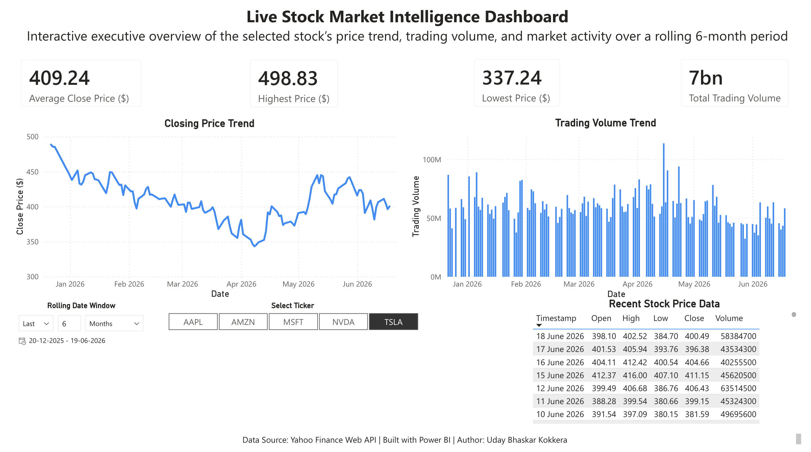
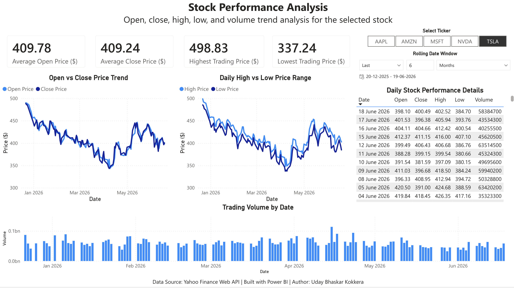
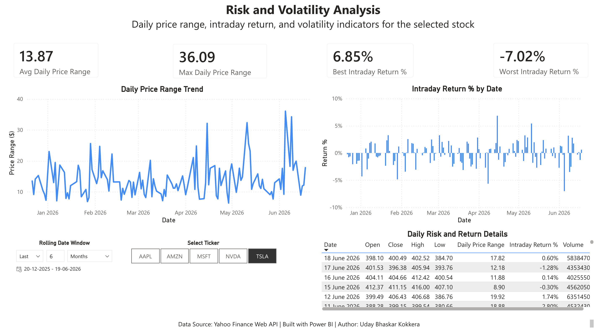
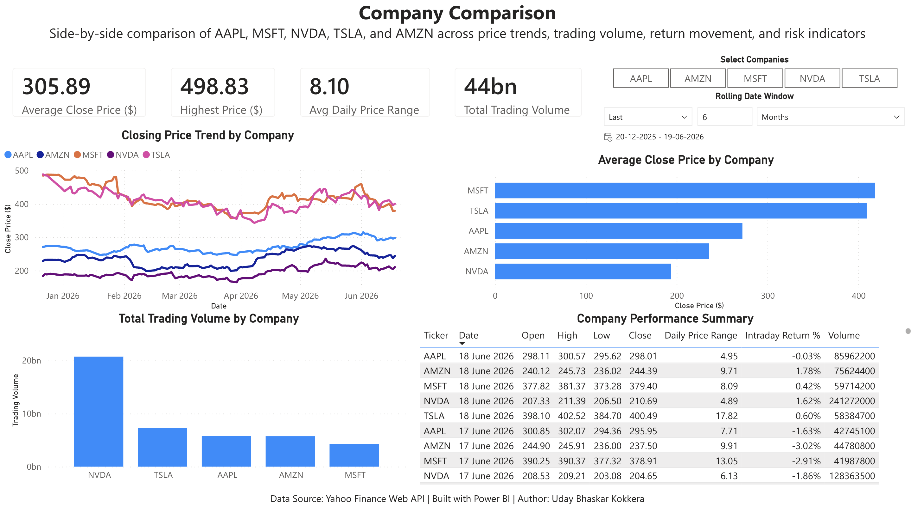

# Live Stock Market Intelligence Dashboard

🔗 **Portfolio Website:** [https://udaybhaskar-23.github.io](https://udaybhaskar-23.github.io)

## Project Overview

This project is an API-connected Power BI dashboard designed to analyze stock market performance across selected technology companies. The dashboard provides interactive insights into stock price trends, trading volume, daily performance, intraday returns, risk indicators, and multi-company comparison.

The project was built as a portfolio dashboard to demonstrate Power BI dashboard development, Power Query data transformation, DAX calculations, financial analysis, and business storytelling.

## Business Problem

Stock market data can be difficult to understand when viewed only as raw daily price records. Investors, analysts, and business users need a simple and interactive way to monitor market activity, analyze individual stock performance, evaluate risk, and compare companies side by side.

This dashboard solves that problem by transforming daily stock market data into clear visual insights.

## Dashboard Objective

The objective of this project is to build a refreshable market intelligence dashboard that allows users to:

* Analyze selected stock performance
* Review price and volume trends
* Evaluate daily price range and intraday return
* Compare multiple technology stocks
* Use interactive slicers for ticker and rolling date window filtering

## Companies Analyzed

The dashboard includes the following stock tickers:

| Ticker | Company               |
| ------ | --------------------- |
| AAPL   | Apple Inc.            |
| AMZN   | Amazon.com Inc.       |
| MSFT   | Microsoft Corporation |
| NVDA   | NVIDIA Corporation    |
| TSLA   | Tesla Inc.            |

## Tools Used

* Power BI
* Power Query
* DAX
* Yahoo Finance Web API
* GitHub

## Dashboard Pages

The Power BI report includes four dashboard pages:

| Page                         | Description                                           |
| ---------------------------- | ----------------------------------------------------- |
| Executive Overview           | High-level summary of the selected stock              |
| Stock Performance Analysis   | Open, close, high, low, and volume trend analysis     |
| Risk and Volatility Analysis | Daily price range and intraday return analysis        |
| Company Comparison           | Side-by-side comparison of selected technology stocks |

## Key Metrics

* Average Close Price
* Highest Price
* Lowest Price
* Total Trading Volume
* Average Open Price
* Daily Price Range
* Intraday Return %
* Best Intraday Return %
* Worst Intraday Return %
* Company-level stock comparison

## Dashboard Preview

### Executive Overview

### Stock Performance Analysis

### Risk and Volatility Analysis

### Company Comparison

## Project Files

| Folder    | Description                               |
| --------- | ----------------------------------------- |
| dashboard | Contains the Power BI PBIX dashboard file |
| images    | Contains dashboard screenshots            |
| docs      | Contains project documentation            |

## Documentation

* [Project Wiki](https://github.com/udaybhaskar-23/Live-Stock-Market-Intelligence-Dashboard/wiki)

Detailed documentation is available in the `docs` folder:

* [Project Summary](docs/project_summary.md)
* [Data Source](docs/data_source.md)
* [Dashboard Design](docs/dashboard_design.md)
* [DAX Measures and Calculated Fields](docs/dax_measures.md)
* [Dashboard Insights](docs/insights.md)

## Data Source

The dashboard uses Yahoo Finance web data through Power Query. The report retrieves daily stock market data for selected tickers and transforms the data for visualization in Power BI.

The data includes:

* Trading date
* Open price
* High price
* Low price
* Close price
* Trading volume
* Stock ticker

## Dashboard Design Approach

The dashboard follows a four-step analysis flow:

1. Start with an executive summary of the selected stock
2. Analyze detailed stock performance trends
3. Evaluate risk and volatility indicators
4. Compare multiple companies side by side

This structure helps users move from quick insights to deeper analysis and then to broader market comparison.

## Key Insights

This dashboard helps users identify:

* Stock price movement trends over time
* Trading volume patterns
* Daily high and low price movement
* Intraday return behavior
* Stocks with higher price movement and volatility
* Company-level differences in price and volume activity

## Skills Demonstrated

This project demonstrates the following skills:

* Power BI dashboard development
* Power Query web API connection
* Data cleaning and transformation
* DAX calculated columns
* KPI design
* Time-series analysis
* Financial data visualization
* Interactive slicer design
* Dashboard storytelling
* GitHub project documentation

## Project Conclusion

This project successfully built an API-connected Power BI market intelligence dashboard for stock market analysis. The final dashboard allows users to analyze individual stock performance, review risk and volatility indicators, and compare multiple technology companies through interactive visuals and slicers.

The project demonstrates how raw stock market data can be transformed into a professional business intelligence dashboard using Power BI.

## Author

**Uday Bhaskar Kokkera**
